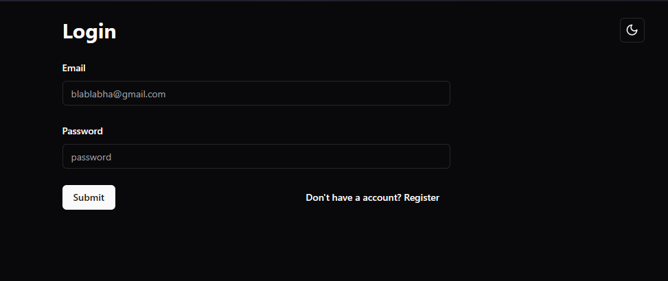

# Login Dashboard using ShadCn/UI



## Getting started:

#### Clone the repository
```Bash
git clone https://github.com/HSp4m/react-beginner-projects
```

#### Navigate to the backend directory
```Bash
cd login-dashboard
cd backend
```

#### Start Prisma configuration on the backend
> [Documentation](https://www.prisma.io/docs/getting-started/setup-prisma/add-to-existing-project/mongodb-typescript-mongodb)

#### Run the backend
```Bash
npm run dev
```

#### Navigate to the frontend directory
```Bash
cd login-dashboard
cd frontend
```

#### Install dependencies
```Bash
npm install
```

#### Run the development server
```Bash
npm run dev
```

###### This will start the development server and open the app in your web browser. You can then access the app at [localhost:5173](http://localhost:5173/).


## Features
- [x] Login, Register
- [x] Theme toggle
- [x] MongoDB integration

## Preview
